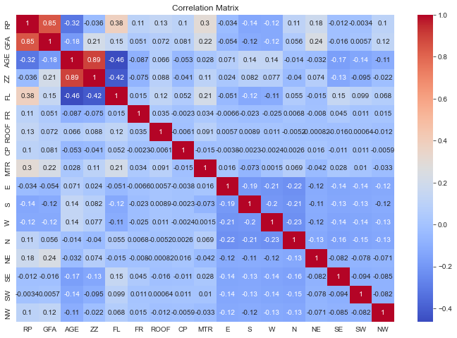

   
  
  
  
    

# Passionate about exploring and advancing the latest in Data Science! 

**Projects & Contributions**: 
| 🖼 Screenshot | 📜 Project | 🛠 Technologies | 📖 Description |
|---|---|---|---|
|  | [WildRift Match Analysis](https://github.com/robert-conner/WildRift-Match-Analysis) | `Python` `Streamlit` `BeautifulSoup & Selenium` | Dynamic and interactive platform for League of Legends: Wild Rift players, aimed at game strategy analysis and performance improvement ✨ |
|  | [ChatGPT Article Building Ecosystem](https://github.com/robert-conner/GPT-Article-Builder-Ecosystem) | `Python` `FAISS Integration` `NLP Techniques` `LangChain` `Prompt Engineering` `OpenAI API` | At its core, this ecosystem leverages the power of GPT (Generative Pre-trained Transformer) and FAISS (Facebook AI Similarity Search) to intelligently generate articles that are not only relevant and engaging but also rooted in authoritative sources. 📚 |
|  | [College Enrollment Prediction](https://github.com/robert-conner/College-Enrollment-Prediction-Project) | `Python` `Jupyter Notebook` `Scikit-learn` `Optuna` `XGBoost` |  Leveraging machine learning algorithms, the project analyzes institutional data from colleges across the United States to uncover patterns and insights that influence enrollment numbers. 🍱  |
|  | [Machine Learning in Real Estate](https://github.com/robert-conner/machine-learning-in-real-estate) | `Python` `Kernel Ridge Regression` `Support Vector Regression` `Multi-Layer Perceptron` `Optuna` | Extends previous research (Choy et al., 2023) on real estate pricing predictions using machine learning. It introduces additional models to test their accuracy alongside previously used algorithms. 🌟 |

### Languages and Tools

  
  
  
  
  
  
  
  
  
  
  
  
  
  
  
  
  
  
   
  

## Who am I?
I have experience as a Data Science Graduate Research Assistant Middle Tennessee State University where I worked on machine vision and chatbot ecosystem projects. I will be graduating in May with a MS in Data Science. I am a Veteran of the US Army where I worked my way up to Sergeant (E-5).

 

My background in data and my experience in the military gives me a lot of transferable skills. I am always challenging myself and rise to the occasion. I have worked on several projects to enhance my data science and data analysis skills. I enjoy identifying insights and patterns from data. I am proficient in Python and SQL and am always leveling up my technology skills.

 

Some notable highlights from my career are:

- <b>Delivered Convolutional Neural Network (CNN)</b> fine-tuning project presentation at ASHS conference 2023 (Orlando) to explain the application of machine learning to non-technical audience 30+ in the agricultural/ horticultural fields, which sparked a series of productive discussions on innovative ways to leverage technology for improved field outcomes

- <b>Developed chatbot ecosystem</b> using the OpenAI API, where LLM chatbots autonomously controlled 3 chatbots for task completion, showcasing potential for operational efficiencies and advancing frontier of automated workflow management in a research context

- <b>Selected for interim role of Platoon Sergeant for Headquarters Platoon</b> (position 2 ranks above current grade) for 1.5 years and mentored managers on leadership, decreasing conflicts and incidents with group by 80%

- <b>Applied statistical analysis and ML techniques</b> (recursive feature elimination, stability selection) to distill comprehensive dataset of soil attributes down to 11 top features for soil quality assessment and plant cover potential

- Engineered a predictive model utilizing Python to analyze enrollment trends across 1,534 US colleges, leveraging <b>LASSO/Ridge Regression, Random Forest, Gradient Boosting, and Feed Forward Neural Networks</b>

- Led study to integrate and evaluate <b>Kernel Ridge Regression (KRR), Support Vector Regression (SVR), and Multi-Layer Perceptron (MLP)</b> against traditional models, demonstrating nuanced model efficacies with MLP showing superior

I enjoy networking with other data professionals. If you would like to chat, please reach out through email or Linkedin!  

 

<b>Programming:</b> Python, R, SQL, MySQL, VBA (Excel Macros), HTML, CSS

<b>Cloud & Data Visualization:</b> Jupyter Notebook, Tableau, Power BI, PyCharm, Google Cloud (GCP)/AWS/Azure

<b>Core Competencies:</b> Data Visualization, Algorithms, Artificial Intelligence, Data Analytics, Statistical Analysis, Data Modeling
